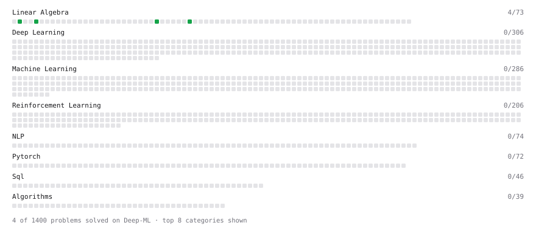

# Deep-ML

My machine learning practice from [Deep-ML](https://www.deep-ml.com). Every solution here was written by hand.

**21** solved · 15 problems · 0 labs · 6 math

[**Browse the interactive portfolio**](https://vishwakumar1311.github.io/deep-ml/) to replay this filling in over time.

## Problems

| | Difficulty | Solved | |
| --- | --- | --- | --- |
| [Calculate Cosine Similarity Between Vectors](https://www.deep-ml.com/problems/76) | easy | 2026-09-15 | [solution](problems/0076-calculate-cosine-similarity-between-vectors) |
| [Calculate Mean by Row or Column](https://www.deep-ml.com/problems/4) | easy | 2026-09-21 | [solution](problems/0004-calculate-mean-by-row-or-column) |
| [Compute the Cross Product of Two 3D Vectors](https://www.deep-ml.com/problems/118) | easy | 2026-09-21 | [solution](problems/0118-compute-the-cross-product-of-two-3d-vectors) |
| [Convert Vector to Diagonal Matrix](https://www.deep-ml.com/problems/35) | easy | 2026-09-23 | [solution](problems/0035-convert-vector-to-diagonal-matrix) |
| [Derivative of a Polynomial](https://www.deep-ml.com/problems/116) | easy | 2026-09-16 | [solution](problems/0116-derivative-of-a-polynomial) |
| [Descriptive Statistics Calculator](https://www.deep-ml.com/problems/78) | easy | 2026-09-16 | [solution](problems/0078-descriptive-statistics-calculator) |
| [Empirical Probability Mass Function (PMF)](https://www.deep-ml.com/problems/184) | easy | 2026-09-20 | [solution](problems/0184-empirical-probability-mass-function-pmf) |
| [Expected Value and Variance of an n-Sided Die](https://www.deep-ml.com/problems/179) | easy | 2026-09-20 | [solution](problems/0179-expected-value-and-variance-of-an-n-sided-die) |
| [Linear Regression Using Gradient Descent](https://www.deep-ml.com/problems/15) | easy | 2026-09-16 | [solution](problems/0015-linear-regression-using-gradient-descent) |
| [Reshape Matrix](https://www.deep-ml.com/problems/3) | easy | 2026-09-23 | [solution](problems/0003-reshape-matrix) |
| [Scalar Multiplication of a Matrix](https://www.deep-ml.com/problems/5) | easy | 2026-09-16 | [solution](problems/0005-scalar-multiplication-of-a-matrix) |
| [Transpose of a Matrix](https://www.deep-ml.com/problems/2) | easy | 2026-09-16 | [solution](problems/0002-transpose-of-a-matrix) |
| [Vector Element-wise Sum](https://www.deep-ml.com/problems/121) | easy | 2026-09-15 | [solution](problems/0121-vector-element-wise-sum) |
| [Vector Norms (L1/L2/L-inf) and the Frobenius Norm](https://www.deep-ml.com/problems/328) | easy | 2026-09-23 | [solution](problems/0328-vector-norms-l1-l2-l-inf-and-the-frobenius-norm) |
| [Matrix times Matrix ](https://www.deep-ml.com/problems/9) | medium | 2026-09-16 | [solution](problems/0009-matrix-times-matrix) |

## Math

| | Difficulty | Solved | |
| --- | --- | --- | --- |
| [Derivatives and Gradients](https://www.deep-ml.com/math-problems/1) | easy | 2026-09-16 | [solution](math/0001-derivatives-and-gradients) |
| [Descriptive Statistics](https://www.deep-ml.com/math-problems/18) | easy | 2026-09-16 | [solution](math/0018-descriptive-statistics) |
| [Gradient Descent Updates](https://www.deep-ml.com/math-problems/5) | easy | 2026-09-16 | [solution](math/0005-gradient-descent-updates) |
| [Probability Fundamentals](https://www.deep-ml.com/math-problems/19) | easy | 2026-09-16 | [solution](math/0019-probability-fundamentals) |
| [Determinants and Trace](https://www.deep-ml.com/math-problems/11) | medium | 2026-09-24 | [solution](math/0011-determinants-and-trace) |
| [Vector Norms and Linear Independence](https://www.deep-ml.com/math-problems/8) | medium | 2026-09-21 | [solution](math/0008-vector-norms-and-linear-independence) |

---

_This file is regenerated by Deep-ML on every push._
